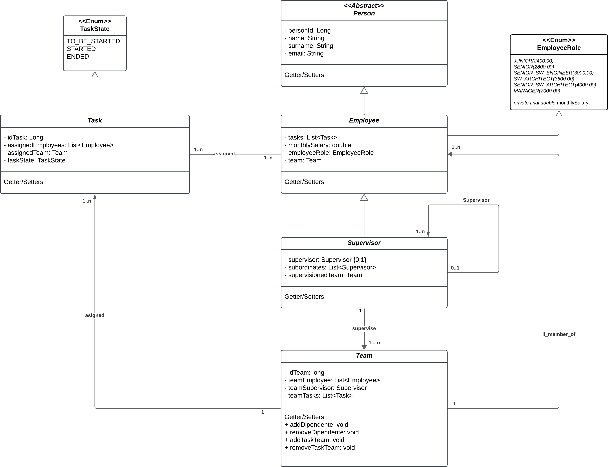

## Nome gruppo
Bug-busters
## Membri del gruppo
| Nome              | Matricola | Email                         |
|-------------------|-----------|-------------------------------|
| Matteo Cervini    | 902225    | m.cervini1@campus.unimib.it   |
| Andrea Aivaliotis | 903571    | a.aivaliotis@campus.unimib.it |
| Le Yang Shi       | 894536    | l.shi1@campus.unimib.it       |

# Il dominio scelto

Abbiamo modellato una versione minimale di un sistema di gestione task simile a Trello/Notion, focalizzandoci sulle entità e sulle regole che governano assegnazioni, team e supervisione. Lo scopo è rappresentare in modo semplice:
- Come vengono create e viste le task,
- Come i team condividono le task,
- Come si struttura la gerarchia dei supervisori.

 
# Analisi di dominio
## Diagramma delle classi


## Analisi del diagramma delle classi

Breve panoramica delle entità principali e del loro ruolo nel modello:

- Person (astratta)
  - Offre attributi comuni a tutte le entità che modellano un attore che possiamo definire attivo(non 
    classe attiva),
    ossia l'effettivo utente di base: personId(che viene ereditato dalle entità concrete), nome, cognome,
    email.
  - Entità che estendono Persona: Dipendente e Supervisore.
  - Per il dominio, non si esclude che in futuro possano esserci altre entità che estendono Persona
   come potrebbe essere un esperto di dominio oppure un consulente che ha partita IVA che viene assunto
   momentaneamente, o altri possibili casi.

- Employee
  - Attributi: il suo ruolo, stipendio mensile, task assegnate e team del quale è membro
  - È una specializzazione di Person
  - Relazioni:
    - Ha assegnate a 1..n Task, ha una relazione molti a molti con un Task: 
      - una task può essere assegnata a più dipendenti
      - un employee può avere più task assegnate
    - Appartiene a 0..1 Team (un employee può non essere in un team).
    - È possibile promuovere un Employee a Supervisor

- Supervisor
  - Attributi: il proprio supervisor, una collezione di supervisori supervisionati e il team supervisionato
  - È una specializzazione di Employee (eredita quindi anche da Person)
  - Relazioni gerarchiche: 
    - Ha 0..1 capi (un supervisor può non avere un capo);
    - Ha 0..n subordinati (altri Supervisors) che supervisiona.
    - Ha 0..1 Team supervisionato (un supervisor supervisiona esattamente un team oppure nessuno).
  - Vincoli: la gerarchia deve essere aciclica; non è permesso che un supervisor sia suo proprio
  subordinato.

- Task
  - Attributi: il suo stato, una collezione di dipendenti ai quali è stata assegnata, e
    il team al quale è stata assegnata. Riporta inoltre l'Employee che l'ha accettata,
    la data di inizio e di chiusura.
  - Ha 0..1 Team ai quali è assegnata (una task può essere assegnata a un team oppure a nessuno):
  quello specifico task può essere assegnata a un solo team
  - Ha 1..n Employees ai quali è stata assegnata, ha una relazione molti a molti con Employee,
  ma una task può essere accettata da un solo Employee:
    - Una task può essere assegnata a più Employees
    - Un Employee può avere più task assegnate
  
- Team
  - Attributi: una collezione di dipendenti membri, il supervisor del team
    e una collezione di Task assegnate al Team.
  - Relazioni:
    - 1..n Employee (un team ha membri; attenzione: un Employee può appartenere ad al più un Team).
    - 0..* Task assegnate al team (visibili a tutti i membri).
    - Un Supervisor (un Team può avere un Supervisor oppure nessuno).

- Enum / Tipi di supporto
  - EmployeeRole 
  - TaskState

# Descrizione funzionale delle classi di persistenza JPA
Tutti i repository estendono `JpaRepository<ID, Long>`, che fornisce metodi CRUD di base. Non è stato
necessaria la creazione una repository di base `BaseRepository<ID, Long> extends JpaRepository<ID, Long>`
poiché abbiamo concluso che non ci sono metodi comuni necessari a tutte le entità.
Non verranno trattati tutti i metodi CRUD di base forniti da `JpaRepository`, ma solo i metodi
personalizzati implementati per soddisfare i requisiti specifici del dominio.

## 1. EmploeeyRepository
La repository `EmploeeyRepository` gestisce la persistenza dell’entità **Dipendente**.
### Metodi personalizzati
- Recupera i dipendenti con uno specifico **stipendio mensile**
- Recupera i dipendenti con uno specifico **stipendio mensile**, ordinati per **ruolo** (crescente)
- Recupera i dipendenti con uno specifico **stipendio mensile**, ordinati per **ruolo** (decrescente)
- Recupera i dipendenti con uno specifico **ruolo**
- Recupera i dipendenti con uno specifico **ruolo**, ordinati per **stipendio mensile** (crescente)
- Recupera i dipendenti con uno specifico **ruolo**, ordinati per **stipendio mensile** (decrescente)
- Recupera i **task** associati a un employee specifico, filtrati per **stato del task**
- Recupera il numero di dipendenti con email che inizia con uno specifico **nome utente**

## 2. SupervisorRepository
La repository `SupervisoreRepository` gestisce la persistenza dell’entità **Supervisore**.
### Metodi personalizzati
- Recupera i **supervisori che non hanno un supervisor** (livello più alto della gerarchia)
- Recupera i **supervisori senza subordinati**
- Recupera i **supervisori che non supervisionano alcun team**

## 4. TeamRepository
La repository `TeamRepository` gestisce la persistenza dell’entità **Team**.
### Metodi personalizzati
- Recupera i team con uno specifico **supervisore**
- Recupera il team con uno specifico **dipendente**
- Recupera il team con uno specifico **task**
- Recupera tutti i task assegnati a uno specifico **team**
- Recupera il supervisore di uno specifico **team**
- Recupera tutti i dipendenti assegnati a uno specifico **team**
- Recupera tutti i task in uno specifico **team** con uno specifico **stato**
- Recupera tutti i dipendenti in uno specifico **team** con lo stipendio maggiore di una **soglia**
- Recupera tutti i dipendenti in uno specifico **team** con lo stipendio minore di una **soglia**
- Recupera tutti i dipendenti in uno specifico **team** con uno specifico **ruolo**

# Descrizione funzionale delle classi di servizio
Le classi service offrono metodi "complessi" che combinano più operazioni di persistenza e
implementano la logica di business specifica del dominio. Questi metodi orchestrano le chiamate ai
repository e applicano le regole di business necessarie. Seppure avvengano operazioni di controllo
null sugli input, alcuni metodi dei service sono reputabili **wrapper** dei repository.

## 1. DipendenteService

La classe `DipendenteService` gestisce le operazioni di business relative all’entità **Dipendente**, 
inclusi ruoli, stipendi e task.

### Controlli preliminari
Tutti i parametri in input devono essere validati per garantire che non siano null.

### CRUD di base
- Creazione di un employee
- Salvataggio di un employee
- Salvataggio di una lista di dipendenti
- Recupero di un employee per ID
- Recupero di tutti i dipendenti
- Rimozione di un employee per ID

### CRUD avanzato e funzionalità specifiche
- Nella gestione della creazione di un employee, viene controllato che l'email non sia già
  utilizzata da un altro employee. In caso contrario, viene gestita la creazione di una email
  unica, aggiungendo un numero progressivo alla fine dell'username. Viene ritentando il salvataggio, 
  in caso non andasse a buon fine viene sollevata eccezione.
  Una stampa di output durante la creazione di due dipendenti è la seguente:
  ``` bash
    Employee{id=1, name='Employee', surname='Employee', email='employee.employee@example.com'}monthlySalaray=2400.0, employeeRole=JUNIOR, tasks=[]}
    Employee{id=2, name='Employee', surname='Employee', email='employee1.employee@example.com'}monthlySalaray=2400.0, employeeRole=JUNIOR, tasks=[]}
  ``` 
- Licenziamento di un employee per Id o lista di Dipendenti(accessibile solo se il employee che
richiede l'operazione è un MANAGER)
- Cerca tutti i dipendenti con stipendio mensile uguale, maggiore, minore o in un intervallo di un 
certo valore e ordinato per ruolo(accessibile solo se il employee che richiede l'operazione è un 
(`MANAGER`)
- Cerca tutti i dipendenti con ruolo uguale, maggiore, minore o in un intervallo di un
  certo valore e ordinato per stipendio mensile(accessibile solo se il employee che richiede
l'operazione è un (`MANAGER`))
- Si può modificare il salario mensile e il ruolo di un employee fornito il corretto ID
(accessibile solo se il employee
che richiede l'operazione è un (`MANAGER`))
- Cerca un insieme di task dato l'Id del employee e un filtro sullo stato della task
- Due metodi helper controllano che gli ID e gli oggetti passati non siano Null tramite
    Optional.requireNonNull. Forniscono inoltre il controllo per i (`MANAGER`).
Se un oggetto non è (`MANAGER`)(e dovrebbe esserlo) oppure non esiste un employee con l'Id
fornito, viene lanciata l'eccezione: (`IllegalArgumentException`). Vengono forniti
messaggi di errore memorizzati nel file: EmployeeContants.
- 
## 2. SupervisoreService

La classe `SupervisoreService` gestisce le operazioni di business relative all’entità **Supervisore** e alle **relazioni gerarchiche** tra supervisori.

### Controlli preliminari
Tutti i parametri in input devono essere validati per garantire che non siano null.

### CRUD di base
- Creazione di un supervisor
- Salvataggio di un supervisor
- Ricerca di un supervisor per ID
- Recupero di tutti i supervisori
- Eliminazione di un supervisor per ID 

### CRUD avanzato e funzionalità specifiche
- Assegnazione di un subordinato a un supervisor 
- Rimozione di un subordinato da un supervisor
- Ricerca di supervisori che non hanno supervisor (radici della gerarchia)
- Ricerca di tutti i supervisori che non hanno subordinati (foglie della gerarchia oppure utile per
a quali supervisori non è stato assegnato nessun subordinato)
- Ricerca di tutti i supervisori non che supervisionano un team (foglie della gerarchia oppure utile per
  a quali supervisori non è stato assegnato nessun team)
- Due metodi helper controllano che gli ID e gli oggetti passati non siano Null tramite
    Optional.requireNonNull. Forniscono inoltre il controllo per i (`SUPERVISORI`) ai quali si sta
cercando di assegnare un subordinato che creerebbe un ciclo nella gerarchia dei supervisori.
    Se un oggetto (`SUPERVISORE`) che è in fase di assegnamento come subordinato crea un loop,
    oppure non esiste un employee con l'Id fornito, viene lanciata l'eccezione: 
- (`IllegalArgumentException`). Vengono forniti messaggi di errore memorizzati nel file: 
SupervisorContants.

## 3. TaskService

La classe `TaskService` gestisce il ciclo di vita delle entità Task, occupandosi della loro creazione, della progressione degli stati e delle assegnazioni dei dipendenti.

### Controlli preliminari
- Tutti i parametri critici (ID, entità, stati, date) vengono validati per garantire che non siano null prima di procedere con le operazioni di business.
- Viene verificata la coerenza logica delle date (es. la data di inizio non può essere successiva a quella di fine).

### CRUD di base

- Creazione: Gestisce l'inizializzazione di un task con uno stato specifico, impostando automaticamente la data di inizio se lo stato è STARTED.
- Salvataggio: Permette di persistere o aggiornare un task esistente tramite il repository.
- Recupero: Offre metodi per trovare task tramite il loro ID univoco o per ottenere l'elenco completo dei task presenti nel sistema.
- Eliminazione: Rimuove un task dal sistema previa verifica della sua esistenza tramite ID.

### Logica degli Stati e Workflow
- Il servizio implementa una macchina a stati per garantire che il flusso di lavoro sia coerente:
- Transizioni vincolate: È possibile passare a STARTED solo partendo da TO_BE_STARTED, e a DONE solo partendo da STARTED.
- Gestione Date: Il sistema aggiorna automaticamente startDate al passaggio in STARTED e endDate al completamento (DONE).
- Reset: Un task può essere riportato allo stato TO_BE_STARTED, operazione che comporta la cancellazione di tutte le date precedentemente registrate.

### Gestione Assegnazioni e Team
- Assegnazione Dipendenti: Permette di associare un Employee a un task, gestendo la relazione bidirezionale e impedendo assegnazioni duplicate o su task già chiusi.
- Rimozione Dipendenti: Gestisce la rimozione di un dipendente dal task, aggiornando correttamente i riferimenti in entrambi gli oggetti.
- Associazione Team: Gestisce il collegamento tra un task e il Team di riferimento che deve supervisionarlo.

### Query Avanzate
- Task Complessi: Recupera i task definiti "complessi" in base a una soglia minima di dipendenti assegnati.
- Filtri di Stato: Permette di filtrare i task per stato (DONE, STARTED, ecc.) o di contare quanti task si trovano in una determinata fase.
- Task Non Assegnati: Identifica tutti i task che non hanno ancora alcun dipendente assegnato.
- Filtri per Team: Permette di estrarre tutti i task associati a uno specifico identificativo di team.

## 4. TeamService

La classe `TeamService` gestisce le operazioni di business relative all’entità **Team**, inclusi dipendenti, supervisori e task assegnate.

### Controlli preliminari
- Tutti i parametri in input devono essere validati per garantire che non siano null.
- Il controllo dell'esistenza di un'entità dato ID viene delegato al service apposito dell'entità.

### CRUD di base
- Creazione di un team
- Salvataggio di un team
- Ricerca di un team per ID
- Recupero di tutti i team
- Eliminazione di un team per ID

### CRUD avanzato e funzionalità specifiche
- Assegnazione di dipendenti a un team gestendo anche la relazione bidirezionale, inoltre se il dipendente 
  appartenesse a un altro team lo si elimina dal team precedente e lo si assegna al nuovo team.
- Rimozione di dipendenti da un team gestendo anche la relazione bidirezionale. 
- Rimozione di tutti i dipendenti da un team gestendo anche la relazione bidirezionale.
- Assegnazione di task a un team gestendo anche la relazione bidirezionale, inoltre se il task appartenesse a
  un altro team lo si elimina dal team precedente e lo si assegna al nuovo team.
- Rimozione di task da un team gestendo anche la relazione bidirezionale.
- Rimozione di tutti i task da un team gestendo anche la relazione bidirezionale.
- Ricerca di tutti i team che hanno una specifica persona come supervisore, controllando che il supervisore esista.
- Ricerca del team a cui appartiene un dipendente specifico, controllando che il dipendente esista.
- Ricerca del team a cui è assegnato un task specifico, controllando che il task esista.
- Ricerca di tutti i task assegnati a un team specifico, controllando che il team esista.
- Ricerca del supervisore di un team specifico, controllando che il team esista.
- Ricerca di tutti i dipendenti assegnati a un team specifico, controllando che il team esista.
- Ricerca di tutti i task in un team specifico con uno specifico stato, controllando che il team esista.
- Ricerca di tutti i dipendenti in un team specifico con lo stipendio maggiore di una certa soglia, controllando che 
  il team esista e che la soglia sia positiva.
- Ricerca di tutti i dipendenti in un team specifico con lo stipendio minore di una certa soglia, controllando che 
  il team esista e che la soglia sia positiva.
- Ricerca di tutti i dipendenti in un team specifico con uno specifico ruolo, controllando che il team esista.
- Quattro metodi helper controllano che gli ID passati non siano Null. Se l'ID fornito è null viene lanciata 
  l'eccezione: (`IllegalArgumentException`). Vengono forniti messaggi di errore memorizzati nel file: TeamContants.
### Note aggiuntive
È stato fatto il test per verificare il giusto comportamento della funzione `getAllTeams()`, si è notato che la 
funzione restituisce tutti i team creati in quel specifico test, invece non restituisce i team creati in altri test.
Questo comportamento è dovuto al fatto che ogni test viene eseguito in una transazione separata, e i dati 
persistiti in un test non sono visibili in un altro test. Sono stati aggiunti altri due test annidati all'interno del 
metodo per verificare che la funzione `getAllTeams()` restituisca tutti i team effettivamente persistiti.

```bash
----------Get all teams test----------
...le stampe dei 2 test annidati...
[1, 2, 3, 4, 5, 6, 7]
```
Dove i numeri rappresentano gli ID dei team creati in tutti e 3 test.  
[4, 5, 6, 7] sono i team creati nei 2 test annidati.  
[1, 2, 3] sono i team creati nel test per la funzione `getAllTeams()`.  
Questo conferma che la funzione `getAllTeams()` funzionerebbe correttamente anche in un ambiente di produzione.

# Facade
- La classe `Facade` è un **wrapper** verso i layer di **service**, esponendo un punto di accesso
unificato alle funzionalità dell’applicazione.
- Non è stata definita una **interfaccia comune della Facade**, poiché la classe è utilizzata 
**esclusivamente a supporto dei test** e non come API pubblica dell’applicazione.
- L’assenza di un’interfaccia non compromette **robustezza e manutenibilità**, dato il ruolo limitato 
della Facade nel progetto.
- Una versione a **interfaccia** sarebbe risultata utile solo nel caso di una **suddivisione della 
Facade in più Facade specifiche per servizio** (es. EmployeeFacade, SupervisorFacade, TaskFacade e TeamFacade).

## 5. TaskRepository
La repository TaskRepository gestisce il ciclo di vita delle attività (Task) e la loro persistenza. Oltre alle operazioni CRUD standard di Spring Data JPA, implementa logiche personalizzate tramite query JPQL per monitorare le assegnazioni e la complessità dei task.

Metodi di filtraggio e conteggio
- findByTaskState: Recupera l'elenco dei task in base a uno specifico stato (es. TO_BE_STARTED, STARTED, DONE).
- countByTaskState: Restituisce il numero totale di task presenti in un determinato stato.
- findTasksByStateWithEmployees: Filtra i task che, oltre ad essere in uno specifico stato, hanno almeno un dipendente assegnato (utile per monitorare i task effettivamente presi in carico).
- findTasksByStateAndEmployeesCount: Permette una ricerca granulare dei task che corrispondono a uno stato specifico e hanno un numero esatto di dipendenti assegnati.

Gestione delle Assegnazioni (Dipendenti e Team)
- findTasksByEmployee: Query JPQL che esegue una JOIN con la collezione assignedEmployees per trovare tutte le attività in carico a un singolo dipendente.
- findTasksWithoutEmployee: Identifica i task "non assegnati" verificando tramite la funzione SIZE() che la lista dei dipendenti sia vuota.
- countEmployeesByTaskId: Restituisce il numero esatto di dipendenti che lavorano su un determinato task identificato dal suo ID.
- findTasksByTeamId: Recupera tutti i task associati a un team specifico tramite una query di JOIN tra l'entità Team e la sua collezione di Task.

Analisi della Complessità
- findTasksWithMoreThanNEmployees: Utilizza la funzione JPQL SIZE() per identificare i task definiti "complessi", ovvero quelli che superano una determinata soglia di dipendenti assegnati.


